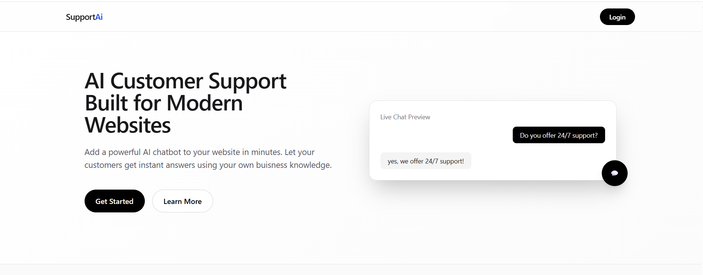
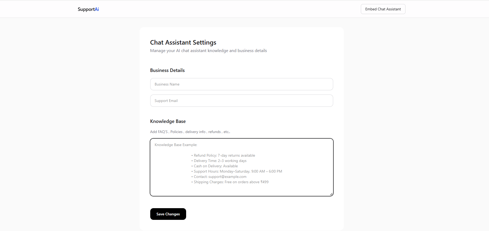
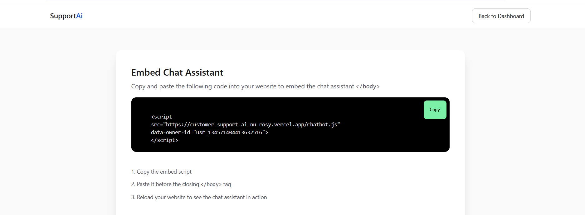
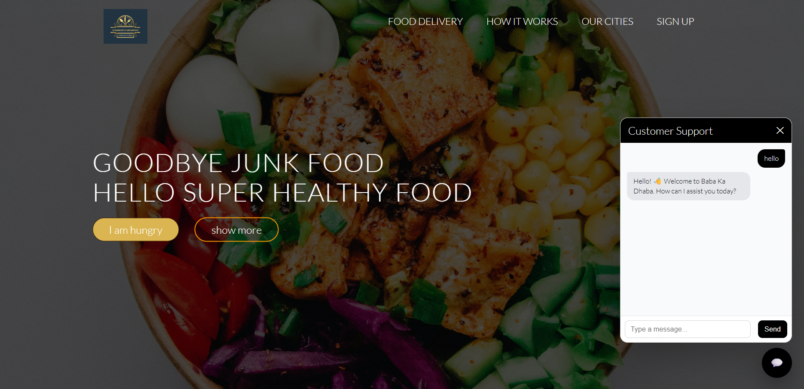

#  Customer Support AI

An AI-powered Customer Support SaaS platform that allows businesses to embed an intelligent chatbot into their websites using a single script tag.

The chatbot answers customer queries using the business's custom knowledge base, reducing manual support efforts and providing instant responses.

---

## 🚀 Live Demo

🌐 https://customer-support-ai-nu-rosy.vercel.app/

---

## ✨ Features

- 🤖 AI-powered customer support chatbot
- 📚 Business-specific Knowledge Base
- 🔗 One-line JavaScript Embed Script
- 🏢 Multi-business support using Owner ID
- 💬 Real-time chatbot widget
- 📊 Business Dashboard
- 🔐 Secure Authentication (Scalekit)
- ☁️ MongoDB Database
- ⚡ Fast Next.js API Routes
- 🎨 Modern Responsive UI

---

## 🛠 Tech Stack

### Frontend

- Next.js 15
- React
- TypeScript
- Tailwind CSS

### Backend

- Next.js API Routes
- TypeScript
- Gemini 2.5 Flash API

### Database

- MongoDB
- Mongoose

### Authentication

- Scalekit

### Deployment

- Vercel

---

## 🖥 Project Workflow

Business Owner

↓

Login

↓

Create Knowledge Base

↓

Generate Embed Script

↓

Paste Script into Website

↓

Website Visitor

↓

AI Chatbot

↓

Gemini AI

↓

Business Knowledge Base

↓

AI Response

---

## 📂 Project Structure

```
src
│
├── app
│   ├── api
│   ├── dashboard
│   ├── embed
│
├── components
│
├── lib
│
├── model
│
└── proxy (also known as middleware)
```

---

## 💻 Installation

Clone the repository

```bash
git clone https://github.com/sjha-dev/Customer-SupportAI.git
```

Go to project

```bash
cd Customer-SupportAI
```

Install dependencies

```bash
npm install
```

Create `.env`

```env
MONGODB_URI=your_mongodb_uri

GEMINI_API_KEY=your_gemini_api_key

SCALEKIT_CLIENT_ID=your_client_id

SCALEKIT_CLIENT_SECRET=your_client_secret

SCALEKIT_ENVIRONMENT_URL=your_environment_url
```

Run locally

```bash
npm run dev
```

---

## 🔗 Embed Script

```html
<script
src="https://your-domain.vercel.app/chatbot.js"
data-owner-id="your_owner_id">
</script>
```

---

## 📸 Screenshots

### Landing Page



---

### Dashboard



---

### Script 



---

### Embedded Chatbot



---

## 📈 Future Improvements

- Conversation History
- Chat Analytics
- File Upload Support
- Multiple AI Models
- Domain Verification
- Rate Limiting
- Streaming AI Responses

---

## 👨‍💻 Author

Sudhanshu Shekhar Jha

GitHub:
https://github.com/sjha-dev

LinkedIn:
(https://www.linkedin.com/in/sjha-dev/)

---

## ⭐ If you like this project

Give this repository a ⭐ on GitHub..